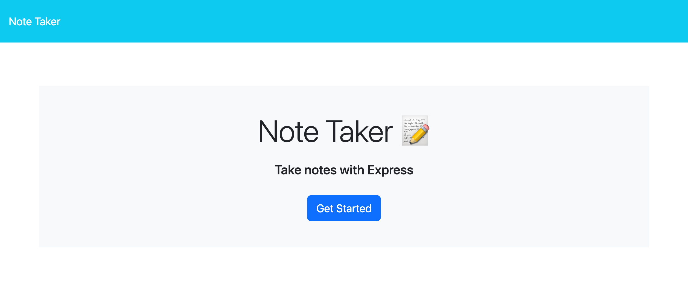
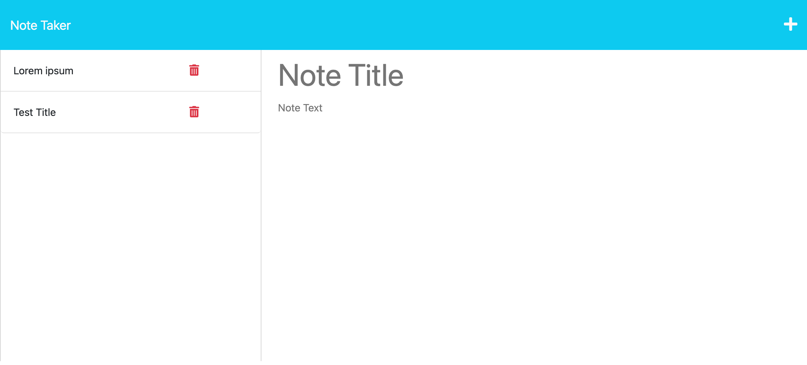

# note-taker
An application to take notes with focus on back-end logic.

## Description

An ExpressJS application that allows user to add and delete notes. 

## Installation

Just need to download the source files from the github repository onto local. Run 'npm install' to ensure that proper packages are installed.

Once index.html is created, open repository in VSCode and right click on index.html file and select "Open with Live Server". 

## Usage

Add note in given area. Click on the 'save' icon in the top left. Notice note renders on the left of the screen. Click 'delete' icon to remove note.

To view this application on Github click [here](https://github.com/GarrettAnderson/note-taker).

To view the live application click [here](https://afternoon-spire-52995.herokuapp.com/).

Below is a screenshot of the project:

## Credits

Used the class work assignments as reference points.

## License

There is no license and this repo is available for reproduction.

